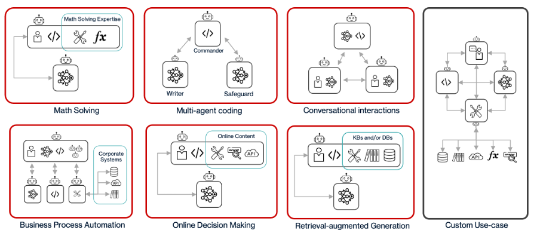
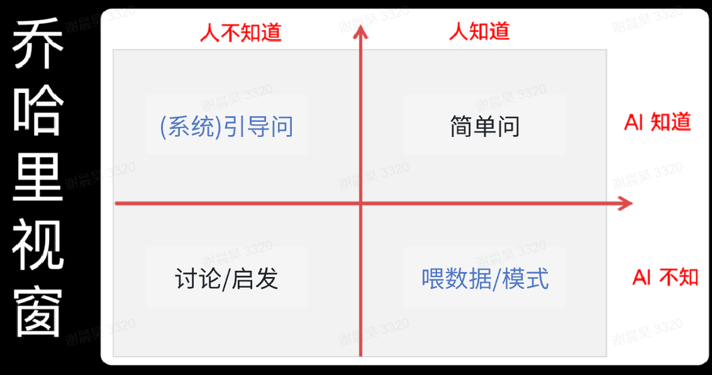
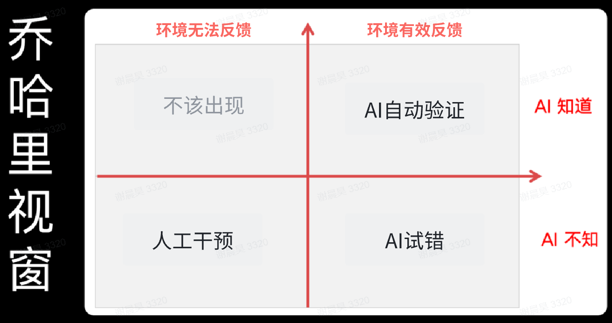
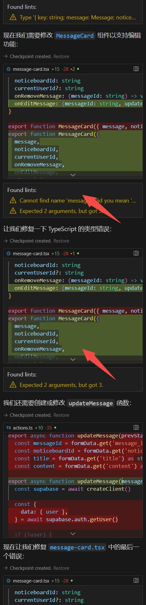
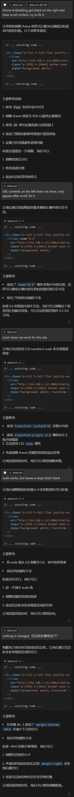
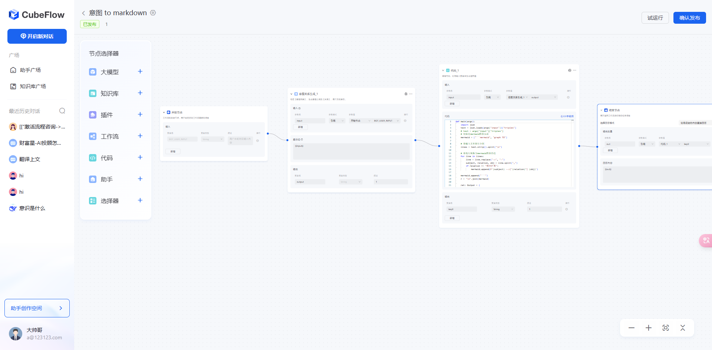
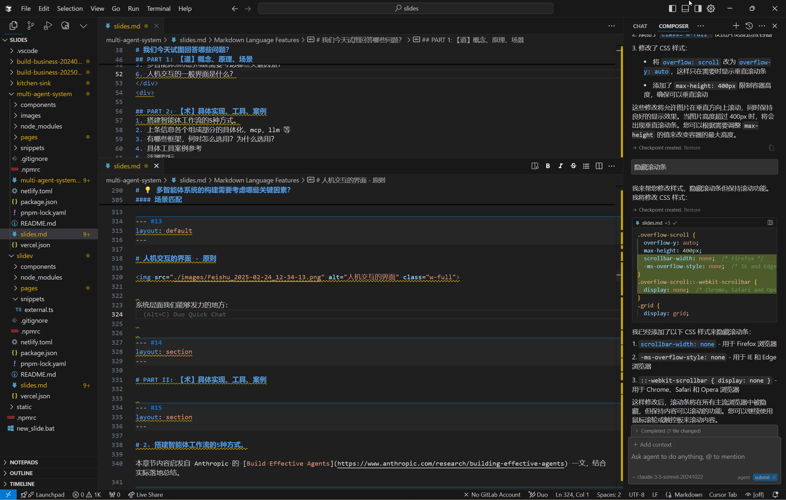
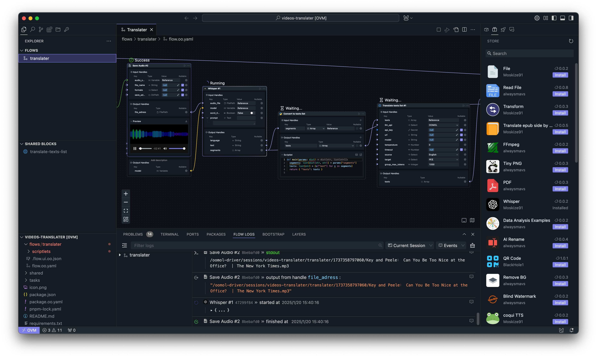
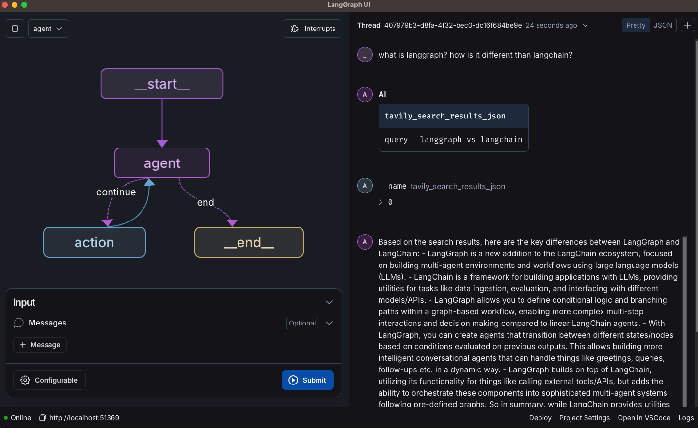

---
# You can also start simply with 'default'
theme: seriph
# random image from a curated Unsplash collection by Anthony
# like them? see https://unsplash.com/collections/94734566/slidev
background: https://source.unsplash.com/collection/94734566
# some information about your slides (markdown enabled)
title:  多智能体系统：理论与实践

info: |
  ## 多智能体系统调研报告
  深入探讨多智能体系统的设计、应用与发展。
# apply unocss classes to the current slide
class: text-center
# https://sli.dev/features/drawing
drawings:
  persist: false
# slide transition: https://sli.dev/guide/animations.html#slide-transitions
transition: slide-left
preload: true
routeAlias: cover
# enable MDC Syntax: https://sli.dev/features/mdc
mdc: true
---

# 多智能体系统：理论与实践

深入探讨多智能体系统的设计、应用与发展

  
    按空格键进入下一页 <carbon:arrow-right class="inline"/>
  

---
title: Multi-Agent System - Theory and Practice
layout: default 
routeAlias: questions
---

# 我们今天试图回答哪些问题？

整体内容分为理论和实践两部分

## PART 1: 【道】

> 概念、原理、场景

1. 什么是智能体? 他和工作流有什么区别？
2. 为什么需要（多）智能体，他解决的是什么问题？
3. 如何识别智能体适合的场景？
4. 多智能体的基本思想是什么？与单智能体的区别？
5. 多智能体系统的构建需要考虑哪些关键因素？
6. 系统在人与模型、多智能体系统交互中的作用？
7. 当前智能体系统的局限与挑战

## PART 2: 【术】

> 具体实现、工具、案例

1. 搭建智能体工作流的5种主流设计模式
2. 智能体的模块和组成部分
3. 工具案例参考
4. 人机交互的一般界面是什么？
5. 评测指标
6. 实际案例 

---
layout: section
routeAlias: part1
---

# PART 1: 【道】
概念、原理、场景

---
layout: default
transition: slide-up
routeAlias: what-is-agent
---

# 1.1 首先，什么是智能体？

在开始介绍多智能体系统之前，我们首先需要搞清楚什么是智能体。

Agent一词的定义：
- Google Dict: a person or thing that takes an active role or produces a **specified effect**.
- Merriam-webster: a computer application designed to automate **certain tasks**.
- Wikipedia: an autonomous, **goal-directed** entity which observes and acts upon an environment

<h3>疑惑：</h3>

- 一次LLM Call 是一个智能体?
- 一个完整任务是一个智能体?

<h3>更多疑惑：</h3>

- 一个完整任务拆解后的每个小任务是一个智能体?
- 多个智能体协作完成一个任务，算不算是一个大的智能体?

Agent这个词的滥用，导致大部分概念是混淆的！

---
layout: fact
transition: slide-up
routeAlias: before-structure
---

## 在开始定义Agent之前，我们先来了解一个基本结构。

---
layout: default
transition: slide-up
routeAlias: augmented-llm
---

# 基础构建块：增强型 LLM（Augmented LLM）

增强型LLM是构建智能体系统的基础模块。它通过集成检索、工具使用和记忆系统等能力来增强基础模型的功能。这些模型能够主动使用这些增强功能，例如生成自己的搜索查询、选择合适的工具，并决定需要保留什么信息。

<h3>核心能力</h3>

- 检索增强：智能搜索和信息获取
- 工具使用：灵活调用外部API和服务
- 记忆系统：维护对话历史和上下文
- 自主决策：根据环境反馈做出选择

<h3>实现重点</h3>

- 场景定制化：根据具体应用场景优化能力
- 接口标准化：确保工具接口清晰易用
- 文档完备性：提供详细的工具使用说明
- 工具生态集成：与第三方工具无缝对接

 

  

误区：
将增强型LLM只是Agent的组成部分，不能等同于Agent。

---
layout: section
transition: slide-left
routeAlias: workflow-agent
---

LLM + Tool + Data Pipeline = Agentic Workflow

做好一个Agentic Workflow已经相当不容易，其中：
- LLM是基础设施，
- Tool是环境和可能性，
- Data Pipeline决定效果上线，是重中之重。

---
layout: default
transition: slide-up
routeAlias: agent-definition
---

# LLM时代，Agent的主流定义

Anthropic对Agent相关的定义：

- 如果一个系统的工作流程是依靠人来编排的，那么它就是Workflow（工作流），即使系统中用到了LLM。
- 如果一个系统的工作流程没有办法事先编排，需要依靠LLM在工作中动态编排，那么它就是Agent。

🤔 构建LLM应用会遇到的两种主流的系统架构：工作流系统和智能体系统。区别是：

  - **工作流**：预先编排的LLM调用序列，步骤固定，按部就班地进行。
  - **智能体**：让大型语言模型（LLM）自主决定运行次数，持续循环直到找到解决方案，具有更高的自主性。

举例，根据描述内容区分工作流还是智能体：

- 总结邮件内容。（Workflow：打开邮箱 → 依次查看昨天的邮件 → 总结邮件 → 任务结束）
- 获取并阅读每天的重要新闻。（Workflow: 1.RSS/爬取/提取正文 2.评分筛选 → 3.总结/摘要/观点/金句/tags。→ 4.分类/归并/总结）
- 填写客户投诉工单。（Workflow：获取聊天记录 → 抽取响应字段Json → 提交工单系统）
- 自动化CodeReview流程。（Workflow：编译构建 → 运行测试 → 根据代码和测试结果生成CodeReview报告）
- 根据git提交把bug流转单填好。（Workflow：总结git提交要点 → 生成bug流转单 → 确认收到确认信息）

---
layout: default
---

# 1.2 如何识别智能体适合的场景？

（多）智能体系统适合的场景：有价值且复杂的任务 

> 核心三要素：价值高、验证容易、出错成本低。

以下场景是否适合使用智能体？
- 根据PRD，编写后端代码。   （Yes，需要根据PRD内容决定代码内容，编写软件产生的代码是不可控的，需要根据代码内容/Linter决定是否需要BugFix。是否通过测试。代码的出错成本很低）
- IM软件中，回复工作消息。   （No，目标太过于广泛，可以是任何人，任何事，不适合直接托管。）
- 客服系统，回复用户消息。   （No，对客交流需要高度可控，且错误容忍度较低，不符合随时回退的假设，更适合高控制的工作流+人工接管）
- 撰写调研报告。   （Yes，调研筛选信息源的过程适合让Agent自行探索&做价值判断，最终人工会检查，因此错误容忍度较高；提效明显）

---
layout: section
transition: slide-left
routeAlias: workflow-vs-agent
---

我们现阶段面临的大部分工作都应该是(Agentic) Workflow，而不是Autonomous Agent

---
layout: default
transition: fade
routeAlias: agent-landscape
---

# 1.2 如何识别智能体适合的场景？

智能体的应用图景

### 主要应用领域
- Coding
- Quality Assurance
- Sales
- IT Support/Operations
- Computer/Web/Mobile Use
- Personal Assistant
- Data Analysis
- Content Creation
- Human Resource
- Customer Support

---
layout: default
transition: slide-left
routeAlias: why-agent
---

# 1.3 为什么需要（多）智能体，他解决的是什么问题？

- "世界/环境"很大：
  - 任意一个网页，在操作后的变化，是几乎不可能穷尽的。
  - 任意一行python代码的输出，是几乎不可预测的。
  - 专业的说法：可被搜索的状态空间很大。

- 任务流程不能被事先编排：
  - 每个步骤的输出都可能影响下一步的决策和执行方式
  - 可能需要多次尝试和回退才能达到目标
  - 需要根据环境反馈动态调整执行计划
  - 甚至某些任务下，完成的标准不是固定的,需要智能体自主判断

- 智能体自主探索更大的可能性：
  - 可以将人类从设计工作流中释放，更专注目标。
  - 降低低层次的重复脑力劳动，比如：代码错误调试，页面点击，信息源筛选过滤等。
  - 智能体可以探索更多人类从未想过的路径和解决方案，从而在复杂场景下可能发现更好的策略
  - 通过数据和反馈不断优化决策，创造工具，自主迭代。

---
layout: default
routeAlias: multi-agent-basics
---

# 1.4. 多智能体的基本思想是什么？与单智能体的区别？

为什么我们需要多智能体？

多智能的引入是自然的：大任务需要拆解，拆解后自然就形成了专业和分工。

通过将复杂任务分解为多个子任务,由不同专长的智能体分别处理,可以实现以下优势:

- 分而治之：不同智能体各司其职,发挥专长
- 并行处理：多个智能体可以同时执行任务
- 鲁棒性强：单个智能体失效不会导致整体系统崩溃
- 可扩展性：根据需要灵活增减智能体数量
- 效率提升：通过分工协作提高整体执行效率

    
     
    <a class="text-sm text-gray-100 mt-2" href="https://www.linkedin.com/pulse/multi-agent-genai-secret-weapon-enterprise-success-miguel-gaspar-4tvgf" target="_blank"> 图源：Multi-agent: A GenAI secret weapon for enterprise success by Miguel Gaspar 
    </a>

---
layout: default
---

# 1.5. 多智能体系统的构建需要考虑哪些关键因素？

### 关键因素

- 🎯 任务优先：让架构适应任务，而不是反过来
- ✨ 简单优先：优先选择最简单的解决方案
- 💰 成本效益：权衡系统延迟和成本与性能需求
- 🔄 容许出错：构建完备的回退机制，容许智能体出错。
- 👀 监控干预：监控智能体运行状态，必要时干预。

### 场景匹配

- 工作流：适合流程固定、要求稳定的任务
- 智能体：适合需要灵活决策的复杂场景

---
layout: default
transition: fade
---

# 1.6. 系统的作用？- 人与模型交互

  

构建LLM系统的意义在于：
- 为模型固化成熟的设计模式、数据管线，从而将高质量人类知识压缩给模型。
- 引导人类提出有效的问题，从而获得高质量的人类反馈。

---
layout: default
routeAlias: key-factors
---

# 1.5. 多智能体系统的构建需要考虑哪些关键因素？

### 关键因素

- 🎯 任务优先：让架构适应任务，而不是反过来
- ✨ 简单优先：优先选择最简单的解决方案
- 💰 成本效益：权衡系统延迟和成本与性能需求
- 🔄 容许出错：构建完备的回退机制，容许智能体出错。
- 👀 监控干预：监控智能体运行状态，必要时干预。

### 场景匹配

- 工作流：适合流程固定、要求稳定的任务
- 智能体：适合需要灵活决策的复杂场景

---
layout: default
transition: fade
routeAlias: human-model-interaction
---

# 1.6. 系统的作用？- 人与模型交互

  

构建LLM系统的意义在于：
- 为模型固化成熟的设计模式、数据管线，从而将高质量人类知识压缩给模型。
- 引导人类提出有效的问题，从而获得高质量的人类反馈。

---
layout: default
routeAlias: human-agent-interaction
---

# 1.6. 系统的作用？- 人与多智能体交互

  

构建MAS系统的意义在于：
- 构建环境：可以将人类探索的环境，尽可能无损地移交给AI。
- 构建保护措施：让AI可以安全地试错，直到成功。
- 构建反馈机制：监控智能体运行状态，必要时干预调整智能体行为。

---
layout: default
routeAlias: limitations
---

# 1.7. 当前智能体系统的局限与挑战

系统设计的局限：卡在同一个地方，无法前进。

LLM的局限：多模态理解能力不足。

---
layout: section
routeAlias: part2
---

# PART II: 【术】
具体实现、工具、案例

---
layout: section
transition: slide-up
routeAlias: workflow-patterns
---

# 2.1 搭建智能体工作流的5种方式

本章节内容启发自 Anthropic 的 [Build Effective Agents](https://www.anthropic.com/research/building-effective-agents) 一文，结合实际落地总结。

---
layout: fact
transition: slide-up
routeAlias: pattern-intro
---

## 设计模式是对于共性场景任务的抽象

---
layout: default
transition: None
routeAlias: workflow-serial-processing
---

# 工作流模式：串行处理

串行处理是一种基础但强大的工作流模式，它将复杂任务分解为一系列顺序执行的步骤。每个步骤的输出作为下一个步骤的输入，形成一个连贯的处理链条。这种模式特别适合需要严格控制和验证的任务。

### 提示链（Prompt Chaining）

提示链是串行处理的典型实现，它通过设计一系列精心编排的提示来引导模型完成复杂任务。每个提示都专注于特定的子任务，通过中间检查点确保输出质量。

<h3>适用场景</h3>

- 任务可拆分：复杂任务可明确划分为子任务
- 固定步骤：处理流程相对稳定且可预测
- 需要中间检查：关键节点需要质量验证
- 精度优先于延迟：对结果准确性要求高

    

---
layout: default
transition: slide-up
routeAlias: workflow-serial-processing-2
---

# 工作流模式：串行处理（续）

  

  ### 感易落地案例

  - 简单知识库问答：
    > 收到Query→知识库检索→答案总结（LLM）→答案输出
    - 已实践的业务：券商投行合规查询，券商客服支持，银行拜年短信生成
    - 难点：
      - **数据管线**：数据治理问题，准备更高质量的上下文（今天不展开）
      - **引用问题**：随着LLM能力提升能变得更好。
    - 实施分拆：
      - 知识库检索、答案总结，都可作为独立模块，单独优化单独评测。
  - 【新的需求】需要结合前序问答信息进行查询。
    - 实际案例（软件使用场景）： 
      > Q1: xxx软件在哪里设置自选股同步?   
      > Q2: ok, 怎么打开多股同列?
    - 改进后的流程：
      > 收到Query→问题改写(LLM)→知识库检索→答案总结（LLM）→答案输出
    - 改写后的提问：
      > Q2: xxx软件怎么打开多股同列?
  

  

  

  <h4>核心要点</h4>

  - 大串行器可以作为顶层设计: 节点可以是代码，LLM Call，API Call，甚至是另一个串行器。
  - 明确定义每个步骤的输入输出: 这样此流程中的每个节点独立运行&复用。
  - 设计合理的检查点和验证机制：可以单元评测，也可以整体评测。
  

   
  

  <h4>避坑&经验总结</h4>

  - 数据传递格式统一：确保各节点间数据格式一致，避免解析错误
  - 性能与延迟平衡：
    - 串行步骤越多，总体延迟越高，在不影响结果质量的前提下，尽量一次LLM多做些事情。
    - 案例：视频口播稿提取。翻译、摘要和去错别字，可以合并成同一个节点而不是分开。
  

  

---
layout: default
transition: slide-up
routeAlias: workflow-routing
---

# 工作流模式：路由分发

路由分发是一种高效的任务分配机制，它根据输入的特征将任务分配给最合适的处理单元。这种模式通过专业化处理提高系统整体效率，同时确保每个任务都能得到最适合的资源处理。

### 感易落地案例

- 客服查询分类：
  >   收到查询→问题路由→检索FAQ→FAQ选择(LLM)→答案输出
  >
  >               ├─→ 检索文档库→RAG流程→答案输出
  >               ├─→ 可控闲聊
  >               └─→ 转人工
  - 经验&避坑：
    - 路由器不一定需要LLM：根据FAQ库中是否能够匹配到问题，来决定是否路由到LLM环节。
    - 路由分类数量的选择：如果分类太多，路由器需要推理的时间太长。
    - 效率提升：如果需要用LLM路由的场景，尽量输出短文本，减少LLM的推理时间。
      - 比如1,2,3,4，而不是"一般场景"，"交易场景"， "软件使用支持场景"，"转人工"。
    - 意图不一定要非常细，如果太细，前序分错了后面模型处理不了。
  - 许多可能的改进：下游拒识反馈给上游重新分类 or 下游并行执行后决策反馈。
- 信息抽取：
  - 先区分信息类型，不同类型信息使用不同模板
  

<h4>核心特点</h4>

- 分而治之：在一开始识别场景，并分类处理，使得后续模型的关注点分离。
- 何时引入此结构？ 
  - ❌ 给模型一段超长prompt，添加一堆工具。
  - ✅ 拆分成多个独立任务，不同类型任务独立处理，可以调用不同的知识库和工具组件。

  

    
  

---
layout: default
transition: slide-up
routeAlias: workflow-parallel-processing
---

# 工作流模式：并行处理

并行处理模式通过同时执行多个任务或使用多个智能体协作来提高系统效率。这种模式特别适合需要多角度分析或处理大量相似任务的场景。通过合理的任务分配和结果整合，可以显著提高处理效率和结果质量。

### 感易落地案例

- 长文本摘要：
  > 分段文本清洗+摘要（并行）→汇总成果
  - 经验&避坑：
    - 段落的切分会影响摘要质量，需要根据实际情况调整。
    - 合理选择子任务避免过大的模型消耗。
- 并行搜索：
  > 调用搜索引擎→并行阅读多个网页链接→汇总结果  
  - 经验&避坑：
    - 并行处理的步骤通常可以使用较便宜的模型，避免过大的模型消耗。
    - 数据源选择需多样化，避免信息茧房和重复信息。
    - 设计合理的权重机制处理不一致信息
- 并行处理的结果通常较多，需要设计合理的**合并机制**。
  - 单次LLM整合：使用LLM整合多个结果，通常用于短结果。
  - 层级整合：先将相似结果分组，再逐层整合，适合大量并行结果的场景。
  - 投票机制：对于事实性内容，可采用多数投票方式确定最终结果。
  - 权重分配：根据来源可靠性、相关度等因素为不同结果分配权重。

<h3>核心特点</h3>

- 任务独立拆分：将大任务分解为独立子任务
- 并行执行：多个处理单元同时工作
- 结果合并：智能整合各个子任务结果

  

---
layout: fact
transition: slide-up
routeAlias: workflow-plus-feedback-is-multi-agent-system
---

工作流 + 反馈迭代 = （多）智能体

上述工作流模式，都可以通过反馈迭代来改进，自然而然就变成了多智能体系统。

---
layout: default
transition: slide-up
routeAlias: agent-orchestrator-executor
---

# 智能体模式：编排者-执行者

编排者-执行者模式是一种高级的任务管理模式，其中编排者负责任务规划和协调，而执行者负责具体任务的实现。这种模式通过明确的职责分工和灵活的任务调度，实现了复杂任务的高效处理。

### 感易落地实践

- 知识问答升级：CubeResearch
  > 编排者：负责任务分解、搜索策略制定和结果整合
  > 
  > 执行者：负责具体信息检索和内容分析，通过多轮反思完成深度研究任务
  - 编排者与执行者可以是同一个增强型LLM。
  - 适用与复杂需要多轮推理的场景。
  - 经验&避坑：
    - **重要**：数据，数据，还是数据。
      - 模型层面用的几乎就是同一个，为什么结果天差地别？
      - 准备高质量的数据管线可以避免执行阶段大量搜索和整合，**大大降低执行时间**。
      - 案例Query： 比较qwen2.5-72b ，deepseek V3 和deepseek R1 在IF-Eval上的表现。
    - 建议引入标准工具接口：e.g., MCP扩展工具能力
      - 结构化数据库：万德、用户库、
      - 非结构化数据：研报、网页、文档
    - 搜索相关：避免过度搜索导致的信息过载，设置合理的搜索深度和广度限制

  

  
  

   
  

  
  

---
layout: default
routeAlias: agent-evaluator-optimizer
---

# 智能体模式：评估者-优化者

评估者-优化者模式是一种迭代改进的模式，通过持续的评估和优化来提高输出质量。这种模式特别适合需要高质量输出的场景，通过多轮反馈和改进来达到预期目标。

### 典型案例

- Cursor Agent + PR Agent：
  > - 评估器：PR Agent用于评估提交质量（提交时） + Linter/Build/Test 用于评估代码质量（提交前）+ 用户反馈（主要通过文档）
  > - 优化者：Cursor Agent用于优化代码
  - 介绍：基于评估-优化模式的代码编辑助手，能够理解代码上下文并提供智能编辑建议
  - 设计优点/借鉴：
    - 获取完整代码上下文+使用MCP协议扩展工具
    - 保留环境和修改历史便于回退不当更改
    - Linter加入评估，自动化非常多简单调试任务。
  - 难点：
    - 代码一致性和冗余：容易写重复的函数，或者不复用原有代码。多次调用之间的代码一致性较难保障。
    - 同一循环卡死：容易陷入同一循环，无法跳出。(优化者可以加入不同角度 or 参考web搜索结果)

  

  ### 工作机制
  - 循环优化：基于评估结果持续改进
  - 反馈驱动：评估结果指导优化方向
  - 质量保证：设定明确的质量标准
  - 迭代改进：通过多轮优化提升质量
  - 终止条件：明确的优化完成标准
  

  

    
  

---
layout: default
transition: slide-up
routeAlias: platform-architecture
---

# 2.2 感易智能体平台架构实现

---
layout: default
routeAlias: mcp-tool-examples
---

# 2.3 工具举例案例

<h3>Model Context Protocol</h3>

- 标准化应用程序向大语言模型提供上下文的方式
- 支持多种上下文类型，如文件、数据库、API等
- 提供灵活的上下文管理机制

### 📂 浏览器自动化

Web 内容访问和自动化功能。支持以 AI 友好格式搜索、抓取和处理 Web 内容。
- [@blackwhite084/playwright-plus-python-mcp](https://github.com/blackwhite084/playwright-plus-python-mcp) 🌐 - 使用 Playwright 进行浏览器自动化的 MCP 服务器，更适合llm
- [@executeautomation/playwright-mcp-server](https://github.com/executeautomation/mcp-playwright) 🌐⚡️ - 使用 Playwright 进行浏览器自动化和网页抓取的 MCP 服务器
- [@automatalabs/mcp-server-playwright](https://github.com/Automata-Labs-team/MCP-Server-Playwright) 🌐🖱️ - 使用 Playwright 实现浏览器自动化的 MCP 服务器
- [@modelcontextprotocol/server-puppeteer](https://github.com/modelcontextprotocol/servers/tree/main/src/puppeteer) 📇 🏠 - 用于网页抓取和交互的浏览器自动化
- [@kimtaeyoon83/mcp-server-youtube-transcript](https://github.com/kimtaeyoon83/mcp-server-youtube-transcript) 📇 ☁️ - 获取 YouTube 字幕和文字记录以供 AI 分析
- [@recursechat/mcp-server-apple-shortcuts](https://github.com/recursechat/mcp-server-apple-shortcuts) 📇 🏠 🍎 - MCP 服务器与 Apple Shortcuts 的集成
- [kimtth/mcp-aoai-web-browsing](https://github.com/kimtth/mcp-aoai-web-browsing) 🐍 🏠 - 使用 Azure OpenAI 和 Playwright 的"最小"服务器/客户端 MCP 实现。
- [@pskill9/web-search](https://github.com/pskill9/web-search) 📇 🏠 - 一个支持使用 Google 搜索结果进行免费网页搜索的 MCP 服务器，无需 API 密钥

### 🎨 艺术与文化

提供艺术收藏、文化遗产和博物馆数据库的访问与探索。让 AI 模型能够搜索和分析艺术文化内容。

- [burningion/video-editing-mcp](https://github.com/burningion/video-editing-mcp) 📹🎬 - 从您的视频集合中添加、分析、搜索和生成视频剪辑
- [r-huijts/rijksmuseum-mcp](https://github.com/r-huijts/rijksmuseum-mcp) 📇 ☁️ - 荷兰国立博物馆 API 集成，支持艺术品搜索、详情查询和收藏品浏览

### ☁️ 云平台

云平台服务集成。实现与云基础设施和服务的管理和交互。

- [Cloudflare MCP Server](https://github.com/cloudflare/mcp-server-cloudflare) 🎖️ 📇 ☁️ - 与 Cloudflare 服务集成，包括 Workers、KV、R2 和 D1
- [Kubernetes MCP Server](https://github.com/strowk/mcp-k8s-go) - 🏎️ ☁️ 通过 MCP 操作 Kubernetes 集群
- [@flux159/mcp-server-kubernetes](https://github.com/Flux159/mcp-server-kubernetes) - 📇 ☁️/🏠 使用 Typescript 实现 Kubernetes 集群中针对 pod、部署、服务的操作。
- [johnneerdael/netskope-mcp](https://github.com/johnneerdael/netskope-mcp) 🔒 ☁️ - 提供对 Netskope Private Access 环境中所有组件的访问权限，包含详细的设置信息和 LLM 使用示例。

### 🖥️ Command Line

运行命令、捕获输出以及以其他方式与 shell 和命令行工具交互。

- [ferrislucas/iterm-mcp](https://github.com/ferrislucas/iterm-mcp) 🖥️ 🛠️ 💬 - 一个为 iTerm 终端提供访问能力的 MCP 服务器。您可以执行命令，并就终端中看到的内容进行提问交互。
- [g0t4/mcp-server-commands](https://github.com/g0t4/mcp-server-commands) 📇 🏠 - 使用"run_command"和"run_script"工具运行任何命令。
- [MladenSU/cli-mcp-server](https://github.com/MladenSU/cli-mcp-server) 🐍 🏠 - 具有安全执行和可定制安全策略的命令行界面
- [tumf/mcp-shell-server](https://github.com/tumf/mcp-shell-server) 实现模型上下文协议 (MCP) 的安全 shell 命令执行服务器

### 💬 社交

与通讯平台集成，实现消息管理和渠道运营。使AI模型能够与团队沟通工具进行交互。

- [zcaceres/gtasks-mcp](https://github.com/zcaceres/gtasks-mcp) - 📇 ☁️ - 用于管理 Google Tasks 的 MCP 服务器
- [hannesrudolph/imessage-query-fastmcp-mcp-server](https://github.com/hannesrudolph/imessage-query-fastmcp-mcp-server) 🐍 🏠 🍎 - MCP 服务器通过模型上下文协议 (MCP) 提供对 iMessage 数据库的安全访问，使 LLM 能够通过适当的电话号码验证和附件处理来查询和分析 iMessage 对话
- [@modelcontextprotocol/server-slack](https://github.com/modelcontextprotocol/servers/tree/main/src/slack) 📇 ☁️ - 用于频道管理和消息传递的 Slack 工作区集成
- [@modelcontextprotocol/server-bluesky](https://github.com/keturiosakys/bluesky-context-server) 📇 ☁️ - Bluesky 实例集成，用于查询和交互
- [MarkusPfundstein/mcp-gsuite](https://github.com/MarkusPfundstein/mcp-gsuite) - 🐍 ☁️ - 与 Gmail 和 Google 日历集成。
- [adhikasp/mcp-twikit](https://github.com/adhikasp/mcp-twikit) 🐍 ☁️ - 与 Twitter 搜索和时间线进行交互
- [gotoolkits/wecombot](https://github.com/gotoolkits/mcp-wecombot-server.git) - 🚀 ☁️  - MCP服务器 Tools 应用程序，用于向企业微信群机器人发送各种类型的消息。
- [AbdelStark/nostr-mcp](https://github.com/AbdelStark/nostr-mcp) - 🌐 ☁️ - Nostr MCP 服务器，支持与 Nostr 交互，可发布笔记等功能。

### 👤 数据平台

提供对客户数据平台内客户资料的访问

- [sergehuber/inoyu-mcp-unomi-server](https://github.com/sergehuber/inoyu-mcp-unomi-server) 📇 ☁️ - MCP 服务器用于访问和更新 Apache Unomi CDP 服务器上的配置文件。
- [OpenDataMCP/OpenDataMCP](https://github.com/OpenDataMCP/OpenDataMCP) 🐍☁️ - 使用模型上下文协议将任何开放数据连接到任何 LLM。
- [tinybirdco/mcp-tinybird](https://github.com/tinybirdco/mcp-tinybird) 🐍☁️ - MCP 服务器可从任何 MCP 客户端与 Tinybird Workspace 进行交互。
- [@iaptic/mcp-server-iaptic](https://github.com/iaptic/mcp-server-iaptic) 🎖️ 📇 ☁️ - 连接 [iaptic](https://www.iaptic.com) 平台，让您轻松查询客户购买记录、交易数据以及应用营收统计信息。

### 🗄️ 数据库

具有模式检查功能的安全数据库访问。支持使用可配置的安全控制（包括只读访问）查询和分析数据。

- [cr7258/elasticsearch-mcp-server](https://github.com/cr7258/elasticsearch-mcp-server) 🐍 🏠 - 集成 Elasticsearch 的 MCP 服务器实现
- [domdomegg/airtable-mcp-server](https://github.com/domdomegg/airtable-mcp-server) 📇 🏠 - Airtable 数据库集成，具有架构检查、读写功能
- [LucasHild/mcp-server-bigquery](https://github.com/LucasHild/mcp-server-bigquery) 🐍 ☁️ - BigQuery 数据库集成了架构检查和查询功能
- [ergut/mcp-bigquery-server](https://github.com/ergut/mcp-bigquery-server) 📇 ☁️ - Google BigQuery 集成的服务器实现，可实现直接 BigQuery 数据库访问和查询功能
- [ClickHouse/mcp-clickhouse](https://github.com/ClickHouse/mcp-clickhouse) 🐍 ☁️ - ClickHouse 数据库集成，支持数据库架构检查和查询功能
- [@fireproof-storage/mcp-database-server](https://github.com/fireproof-storage/mcp-database-server) 📇 ☁️ - Fireproof 分布式账本数据库，支持多用户数据同步
- [designcomputer/mysql_mcp_server](https://github.com/designcomputer/mysql_mcp_server) 🐍 🏠 - MySQL 数据库集成可配置的访问控制、模式检查和全面的安全指南
- [f4ww4z/mcp-mysql-server](https://github.com/f4ww4z/mcp-mysql-server) 🐍 🏠 - 基于 Node.js 的 MySQL 数据库集成，提供安全的 MySQL 数据库操作
- [@modelcontextprotocol/server-postgres](https://github.com/modelcontextprotocol/servers/tree/main/src/postgres) 📇 🏠 - PostgreSQL 数据库集成了模式检查和查询功能
- [@modelcontextprotocol/server-sqlite](https://github.com/modelcontextprotocol/servers/tree/main/src/sqlite) 🐍 🏠 - 具有内置分析功能的 SQLite 数据库操作
- [@joshuarileydev/supabase-mcp-server](https://github.com/joshuarileydev/supabase) - Supabase MCP 服务器用于管理和创建 Supabase 中的项目和组织
- [ktanaka101/mcp-server-duckdb](https://github.com/ktanaka101/mcp-server-duckdb) 🐍 🏠 - DuckDB 数据库集成了模式检查和查询功能
- [QuantGeekDev/mongo-mcp](https://github.com/QuantGeekDev/mongo-mcp) 📇 🏠 - MongoDB 集成使 LLM 能够直接与数据库交互。
- [tinybirdco/mcp-tinybird](https://github.com/tinybirdco/mcp-tinybird) 🐍 ☁️ - Tinybird 集成查询和 API 功能
- [kiliczsh/mcp-mongo-server](https://github.com/kiliczsh/mcp-mongo-server) 📇 🏠 - MongoDB 的模型上下文协议服务器
- [KashiwaByte/vikingdb-mcp-server](https://github.com/KashiwaByte/vikingdb-mcp-server) 🐍 ☁️ - VikingDB 数据库集成了collection和index的基本信息介绍，并提供向量存储和查询的功能.
- [neo4j-contrib/mcp-neo4j](https://github.com/neo4j-contrib/mcp-neo4j) 🐍 🏠 - Neo4j 的模型上下文协议
- [isaacwasserman/mcp-snowflake-server](https://github.com/isaacwasserman/mcp-snowflake-server) 🐍 ☁️ - Snowflake 集成实现，支持读取和（可选）写入操作，并具备洞察跟踪功能
- [hannesrudolph/sqlite-explorer-fastmcp-mcp-server](https://github.com/hannesrudolph/sqlite-explorer-fastmcp-mcp-server) 🐍 🏠 - 一个 MCP 服务器，通过模型上下文协议 （MCP） 提供对 SQLite 数据库的安全只读访问。该服务器是使用 FastMCP 框架构建的，它使 LLM 能够探索和查询具有内置安全功能和查询验证的 SQLite 数据库。
- [sirmews/mcp-pinecone](https://github.com/sirmews/mcp-pinecone) 🐍 ☁️ - Pinecone 与矢量搜索功能的集成
- [runekaagaard/mcp-alchemy](https://github.com/runekaagaard/mcp-alchemy) 🐍 🏠 - 基于SQLAlchemy的通用数据库集成，支持PostgreSQL、MySQL、MariaDB、SQLite、Oracle、MS SQL Server等众多数据库。具有架构和关系检查以及大型数据集分析功能。

### 💻 开发者工具

增强开发工作流程和环境管理的工具和集成。

- [QuantGeekDev/docker-mcp](https://github.com/QuantGeekDev/docker-mcp) 🏎️ 🏠 - 通过 MCP 进行 Docker 容器管理和操作
- [zcaceres/fetch-mcp](https://github.com/zcaceres/fetch-mcp) 📇 🏠 - 一个灵活获取 JSON、文本和 HTML 数据的 MCP 服务器
- [r-huijts/xcode-mcp-server](https://github.com/r-huijts/xcode-mcp-server) 📇 🏠 🍎 - Xcode 集成，支持项目管理、文件操作和构建自动化
- [snaggle-ai/openapi-mcp-server](https://github.com/snaggle-ai/openapi-mcp-server) 🏎️ 🏠 - 使用开放 API 规范 (v3) 连接任何 HTTP/REST API 服务器
- [jetbrains/mcpProxy](https://github.com/JetBrains/mcpProxy) 🎖️ 📇 🏠 - 连接到 JetBrains IDE
- [tumf/mcp-text-editor](https://github.com/tumf/mcp-text-editor) 🐍 🏠 - 面向行的文本文件编辑器。针对 LLM 工具进行了优化，具有高效的部分文件访问功能，可最大限度地减少令牌使用量。
- [@joshuarileydev/simulator-mcp-server](https://github.com/JoshuaRileyDev/simulator-mcp-server) 📇 🏠 - 用于控制 iOS 模拟器的 MCP 服务器
- [@joshuarileydev/app-store-connect-mcp-server](https://github.com/JoshuaRileyDev/app-store-connect-mcp-server) 📇 🏠 - 一个 MCP 服务器，用于与 iOS 开发者的 App Store Connect API 进行通信
- [@sammcj/mcp-package-version](https://github.com/sammcj/mcp-package-version) 📦 🏠 - MCP 服务器可帮助 LLM 在编写代码时建议最新的稳定软件包版本。
- [delano/postman-mcp-server](https://github.com/delano/postman-mcp-server) 📇 ☁️ - 与 [Postman API](https://www.postman.com/postman/postman-public-workspace/) 进行交互
- [vivekVells/mcp-pandoc](https://github.com/vivekVells/mcp-pandoc) 🗄️ 🚀 - 基于 Pandoc 的 MCP 服务器，支持 Markdown、HTML、PDF、DOCX（.docx）、csv 等格式之间的无缝转换
- [pskill9/website-downloader](https://github.com/pskill9/website-downloader) 🗄️ 🚀 - 这个 MCP 服务器提供了使用 wget 下载完整网站的工具，可保留网站结构并转换链接以支持本地访问
- [j4c0bs/mcp-server-sql-analyzer](https://github.com/j4c0bs/mcp-server-sql-analyzer) 🐍 - 基于 [SQLGlot](https://github.com/tobymao/sqlglot) 的 MCP 服务器，提供 SQL 分析、代码检查和方言转换功能

### 🧮 数据科学工具

旨在简化数据探索、分析和增强数据科学工作流程的集成和工具。

- [@reading-plus-ai/mcp-server-data-exploration](https://github.com/reading-plus-ai/mcp-server-data-exploration) 🐍 ☁️ - 支持对基于 .csv 的数据集进行自主数据探索，以最小的成本提供智能见解。
- [zcaceres/markdownify-mcp](https://github.com/zcaceres/markdownify-mcp) 📇 🏠 - 一个 MCP 服务器，可将几乎任何文件或网络内容转换为 Markdown

### 📂 文件系统

提供对本地文件系统的直接访问，并具有可配置的权限。使 AI 模型能够读取、写入和管理指定目录中的文件。

- [@modelcontextprotocol/server-filesystem](https://github.com/modelcontextprotocol/servers/tree/main/src/filesystem) 📇 🏠 - 直接访问本地文件系统。
- [@modelcontextprotocol/server-google-drive](https://github.com/modelcontextprotocol/servers/tree/main/src/gdrive) 📇 ☁️ - Google Drive 集成，用于列出、阅读和搜索文件
- [hmk/box-mcp-server](https://github.com/hmk/box-mcp-server) 📇 ☁️ - Box 集成，支持文件列表、阅读和搜索功能
- [mark3labs/mcp-filesystem-server](https://github.com/mark3labs/mcp-filesystem-server) 🏎️ 🏠 - 用于本地文件系统访问的 Golang 实现。
- [mamertofabian/mcp-everything-search](https://github.com/mamertofabian/mcp-everything-search) 🐍 🏠 🪟 - 使用 Everything SDK 实现的快速 Windows 文件搜索
- [cyberchitta/llm-context.py](https://github.com/cyberchitta/llm-context.py) 🐍 🏠 - 通过 MCP 或剪贴板与 LLM 共享代码上下文

### 💰 金融 & 金融科技

金融数据访问和加密货币市场信息。支持查询实时市场数据、加密货币价格和财务分析。

- [QuantGeekDev/coincap-mcp](https://github.com/QuantGeekDev/coincap-mcp) 📇 ☁️ - 使用 CoinCap 的公共 API 集成实时加密货币市场数据，无需 API 密钥即可访问加密货币价格和市场信息
- [anjor/coinmarket-mcp-server](https://github.com/anjor/coinmarket-mcp-server) 🐍 ☁️ - Coinmarket API 集成以获取加密货币列表和报价
- [berlinbra/alpha-vantage-mcp](https://github.com/berlinbra/alpha-vantage-mcp) 🐍 ☁️ - Alpha Vantage API 集成，用于获取股票和加密货币信息
- [ferdousbhai/tasty-agent](https://github.com/ferdousbhai/tasty-agent) 🐍 ☁️ - Tastyworks API 集成，用于管理 Tastytrade 平台的交易活动

### 🧠 知识与记忆

使用知识图谱结构的持久内存存储。使 AI 模型能够跨会话维护和查询结构化信息。

- [@modelcontextprotocol/server-memory](https://github.com/modelcontextprotocol/servers/tree/main/src/memory) 📇 🏠 - 基于知识图谱的长期记忆系统用于维护上下文
- [/CheMiguel23/MemoryMesh](https://github.com/CheMiguel23/MemoryMesh) 📇 🏠 - 增强基于图形的记忆，重点关注 AI 角色扮演和故事生成
- [/topoteretes/cognee](https://github.com/topoteretes/cognee/tree/dev/cognee-mcp) 📇 🏠 - AI应用程序和Agent的内存管理器使用各种图存储和向量存储，并允许从 30 多个数据源提取数据
- [@hannesrudolph/mcp-ragdocs](https://github.com/hannesrudolph/mcp-ragdocs) 🐍 🏠 - MCP 服务器实现提供了通过矢量搜索检索和处理文档的工具，使 AI 助手能够利用相关文档上下文来增强其响应能力
- [@kaliaboi/mcp-zotero](https://github.com/kaliaboi/mcp-zotero) 📇 ☁️ - 为 LLM 提供的连接器，用于操作 Zotero Cloud 上的文献集合和资源

### 🗺️ 位置服务

地理和基于位置的服务集成。支持访问地图数据、方向和位置信息。

- [@modelcontextprotocol/server-google-maps](https://github.com/modelcontextprotocol/servers/tree/main/src/google-maps) 📇 ☁️ - Google 地图集成，提供位置服务、路线规划和地点详细信息
- [SecretiveShell/MCP-timeserver](https://github.com/SecretiveShell/MCP-timeserver) 🐍 🏠 - 访问任意时区的时间并获取当前本地时间
- [webcoderz/MCP-Geo](https://github.com/webcoderz/MCP-Geo) 🐍 🏠 - 支持 nominatim、ArcGIS、Bing 的地理编码 MCP 服务器
- [@briandconnelly/mcp-server-ipinfo](https://github.com/briandconnelly/mcp-server-ipinfo) 🐍 ☁️ - 使用 IPInfo API 获取 IP 地址的地理位置和网络信息

### 🎯 营销

用于创建和编辑营销内容、处理网页元数据、产品定位和编辑指南的工具。

- [Open Strategy Partners Marketing Tools](https://github.com/open-strategy-partners/osp_marketing_tools) 🐍 🏠 - Open Strategy Partners 提供的营销工具套件，包含写作风格指南、编辑规范和产品营销价值图谱创建工具

### 📊 监测

访问和分析应用程序监控数据。使 AI 模型能够审查错误报告和性能指标。

- [@modelcontextprotocol/server-sentry](https://github.com/modelcontextprotocol/servers/tree/main/src/sentry) 🐍 ☁️ - Sentry.io 集成用于错误跟踪和性能监控
- [@modelcontextprotocol/server-raygun](https://github.com/MindscapeHQ/mcp-server-raygun) 📇 ☁️ - Raygun API V3 集成用于崩溃报告和真实用户监控
- [metoro-io/metoro-mcp-server](https://github.com/metoro-io/metoro-mcp-server) 🎖️ 🏎️ ☁️ - 查询并与 Metoro 监控的 kubernetes 环境交互
- [grafana/mcp-grafana](https://github.com/grafana/mcp-grafana) 🎖️ 🐍 🏠 ☁️ - 在 Grafana 实例中搜索仪表盘、调查事件并查询数据源

### 🔎 搜索

- [@modelcontextprotocol/server-brave-search](https://github.com/modelcontextprotocol/servers/tree/main/src/brave-search) 📇 ☁️ - 使用 Brave 的搜索 API 实现网页搜索功能
- [@angheljf/nyt](https://github.com/angheljf/nyt) 📇 ☁️ - 使用 NYTimes API 搜索文章
- [@modelcontextprotocol/server-fetch](https://github.com/modelcontextprotocol/servers/tree/main/src/fetch) 🐍 🏠 ☁️ - 高效获取和处理网页内容，供 AI 使用
- [ac3xx/mcp-servers-kagi](https://github.com/ac3xx/mcp-servers-kagi) 📇 ☁️ - Kagi 搜索 API 集成
- [exa-labs/exa-mcp-server](https://github.com/exa-labs/exa-mcp-server) 🎖️ 📇 ☁️ – 模型上下文协议 (MCP) 服务器让 Claude 等 AI 助手可以使用 Exa AI Search API 进行网络搜索。此设置允许 AI 模型以安全且可控的方式获取实时网络信息。
- [fatwang2/search1api-mcp](https://github.com/fatwang2/search1api-mcp) 📇 ☁️ - 通过 search1api 搜索（需要付费 API 密钥）
- [Tomatio13/mcp-server-tavily](https://github.com/Tomatio13/mcp-server-tavily) ☁️ 🐍 – Tavily AI 搜索 API
- [blazickjp/arxiv-mcp-server](https://github.com/blazickjp/arxiv-mcp-server) ☁️ 🐍 - 搜索 ArXiv 研究论文
- [mzxrai/mcp-webresearch](https://github.com/mzxrai/mcp-webresearch) 🔍📚 - 在 Google 上搜索并对任何主题进行深度研究
- [andybrandt/mcp-simple-arxiv](https://github.com/andybrandt/mcp-simple-arxiv) - 🐍 ☁️  MCP for LLM 用于搜索和阅读 arXiv 上的论文)
- [andybrandt/mcp-simple-pubmed](https://github.com/andybrandt/mcp-simple-pubmed) - 🐍 ☁️  MCP 用于搜索和阅读 PubMed 中的医学/生命科学论文。
- [apify/mcp-server-rag-web-browser](https://github.com/apify/mcp-server-rag-web-browser) 📇 ☁️ - 一个用于 Apify 的 RAG Web 浏览器 Actor 的 MCP 服务器，可以执行网页搜索、抓取 URL，并以 Markdown 格式返回内容。
- [SecretiveShell/MCP-searxng](https://github.com/SecretiveShell/MCP-searxng) 🐍 🏠 - 用于连接到 searXNG 实例的 MCP 服务器
- [Bigsy/Clojars-MCP-Server](https://github.com/Bigsy/Clojars-MCP-Server) 📇 ☁️ - Clojars MCP 服务器，提供 Clojure 库的最新依赖信息
- [Ihor-Sokoliuk/MCP-SearXNG](https://github.com/ihor-sokoliuk/mcp-searxng) 📇 🏠/☁️ - [SearXNG](https://docs.searxng.org) 的模型上下文协议服务器
- [erithwik/mcp-hn](https://github.com/erithwik/mcp-hn) 🐍 ☁️ - 一个用于搜索 Hacker News、获取热门故事等的 MCP 服务器。
- [chanmeng/google-news-mcp-server](https://github.com/ChanMeng666/server-google-news) 📇 ☁️ - Google News 集成，具有自动主题分类、多语言支持，以及通过 [SerpAPI](https://serpapi.com/) 提供的标题、故事和相关主题的综合搜索功能。
- [devflowinc/trieve](https://github.com/devflowinc/trieve/tree/main/clients/mcp-server) 🎖️📇☁️🏠 - 通过 [Trieve](https://trieve.ai) 爬取、嵌入、分块、搜索和检索数据集中的信息

### 🔒 安全

- [dnstwist MCP Server](https://github.com/BurtTheCoder/mcp-dnstwist) 📇🪟☁️ - dnstwist 的 MCP 服务器，这是一个强大的 DNS 模糊测试工具，可帮助检测域名抢注、钓鱼和企业窃密行为
- [Maigret MCP Server](https://github.com/BurtTheCoder/mcp-maigret) 📇 ☁️ - maigret 的 MCP 服务器，maigret 是一款强大的 OSINT 工具，可从各种公共来源收集用户帐户信息。此服务器提供用于在社交网络中搜索用户名和分析 URL 的工具。
- [Shodan MCP Server](https://github.com/BurtTheCoder/mcp-shodan) 📇 ☁️ - MCP 服务器用于查询 Shodan API 和 Shodan CVEDB。此服务器提供 IP 查找、设备搜索、DNS 查找、漏洞查询、CPE 查找等工具。
- [VirusTotal MCP Server](https://github.com/BurtTheCoder/mcp-virustotal) 📇 ☁️ - 用于查询 VirusTotal API 的 MCP 服务器。此服务器提供用于扫描 URL、分析文件哈希和检索 IP 地址报告的工具。
- [ORKL MCP Server](https://github.com/fr0gger/MCP_Security) 📇🛡️☁️ - 用于查询 ORKL API 的 MCP 服务器。此服务器提供获取威胁报告、分析威胁行为者和检索威胁情报来源的工具。
- [Security Audit MCP Server](https://github.com/qianniuspace/mcp-security-audit) 📇🛡️☁️ 一个强大的 MCP (模型上下文协议) 服务器，审计 npm 包依赖项的安全漏洞。内置远程 npm 注册表集成，以进行实时安全检查。

### 🚆 旅行与交通

访问旅行和交通信息。可以查询时刻表、路线和实时旅行数据。

- [NS Travel Information MCP Server](https://github.com/r-huijts/ns-mcp-server) 📇 ☁️ - 了解荷兰铁路 (NS) 的旅行信息、时刻表和实时更新

### 🔄 版本控制

与 Git 存储库和版本控制平台交互。通过标准化 API 实现存储库管理、代码分析、拉取请求处理、问题跟踪和其他版本控制操作。

- [@modelcontextprotocol/server-github](https://github.com/modelcontextprotocol/servers/tree/main/src/github) 📇 ☁️ - GitHub API集成用于仓库管理、PR、问题等
- [@modelcontextprotocol/server-gitlab](https://github.com/modelcontextprotocol/servers/tree/main/src/gitlab) 📇 ☁️ 🏠 - GitLab平台集成用于项目管理和CI/CD操作
- [@modelcontextprotocol/server-git](https://github.com/modelcontextprotocol/servers/tree/main/src/git) 🐍 🏠 - 直接的Git仓库操作，包括读取、搜索和分析本地仓库
- [adhikasp/mcp-git-ingest](https://github.com/adhikasp/mcp-git-ingest) 🐍 🏠 - 使用 LLM 阅读和分析 GitHub 存储库

### 🛠️ 其他工具和集成

- [apify/actors-mcp-server](https://github.com/apify/actors-mcp-server) 📇 ☁️ - 使用超过 3,000 个预构建的云工具（称为 Actors）从网站、电商、社交媒体、搜索引擎、地图等提取数据。
- [ivo-toby/contentful-mcp](https://github.com/ivo-toby/contentful-mcp) 📇 🏠 - 更新、创建、删除 Contentful Space 中的内容、内容模型和资产
- [mzxrai/mcp-openai](https://github.com/mzxrai/mcp-openai) 📇 ☁️ - 与 OpenAI 最智能的模型聊天
- [mrjoshuak/godoc-mcp](https://github.com/mrjoshuak/godoc-mcp) 🏎️ 🏠 - 高效的 Go 文档服务器，让 AI 助手可以智能访问包文档和类型，而无需阅读整个源文件
- [pierrebrunelle/mcp-server-openai](https://github.com/pierrebrunelle/mcp-server-openai) 🐍 ☁️ - 直接从Claude查询OpenAI模型，使用MCP协议
- [@modelcontextprotocol/server-everything](https://github.com/modelcontextprotocol/servers/tree/main/src/everything) 📇 🏠 - MCP服务器，涵盖MCP协议的所有功能
- [baba786/phabricator-mcp-server](https://github.com/baba786/phabricator-mcp-server) 🐍 ☁️ - 与Phabricator API交互
- [MarkusPfundstein/mcp-obsidian](https://github.com/MarkusPfundstein/mcp-obsidian) 🐍 ☁️ 🏠 - 通过REST API与Obsidian交互
- [calclavia/mcp-obsidian](https://github.com/calclavia/mcp-obsidian) 📇 🏠 - 这是一个连接器，允许Claude Desktop（或任何MCP兼容应用程序）读取和搜索包含Markdown笔记的目录（如Obsidian库）。
- [anaisbetts/mcp-youtube](https://github.com/anaisbetts/mcp-youtube) 📇 ☁️ - 获取YouTube字幕
- [danhilse/notion_mcp](https://github.com/danhilse/notion_mcp) 🐍 ☁️ - 与Notion API集成，管理个人待办事项列表
- [rusiaaman/wcgw](https://github.com/rusiaaman/wcgw/blob/main/src/wcgw/client/mcp_server/Readme.md) 🐍 🏠 - 自动化shell执行、计算机控制和编码代理。（Mac）
- [reeeeemo/ancestry-mcp](https://github.com/reeeeemo/ancestry-mcp) 🐍 🏠 - 允许AI读取.ged文件和基因数据
- [sirmews/apple-notes-mcp](https://github.com/sirmews/apple-notes-mcp) 🐍 🏠 - 允许AI读取本地Apple Notes数据库（仅限macOS）
- [anjor/coinmarket-mcp-server](https://github.com/anjor/coinmarket-mcp-server) 🐍 🏠 - Coinmarket API集成，用于获取加密货币列表和报价
- [suekou/mcp-notion-server](https://github.com/suekou/mcp-notion-server) 📇 🏠 - 与Notion API交互
- [amidabuddha/unichat-mcp-server](https://github.com/amidabuddha/unichat-mcp-server) 🐍/📇 ☁️ - 使用MCP协议通过工具或预定义的提示发送请求给OpenAI、MistralAI、Anthropic、xAI或Google AI。需要供应商API密钥
- [evalstate/mcp-miro](https://github.com/evalstate/mcp-miro) 📇 ☁️ - 访问 MIRO 白板，批量创建和读取项目。需要 REST API 的 OAUTH 密钥。
- [KS-GEN-AI/jira-mcp-server](https://github.com/KS-GEN-AI/jira-mcp-server) 📇 ☁️ 🍎 🪟 - 通过 JQL 和 API 读取 Jira 数据，并执行创建和编辑工单的请求
- [KS-GEN-AI/confluence-mcp-server](https://github.com/KS-GEN-AI/confluence-mcp-server) 📇 ☁️ 🍎 🪟 - 通过 CQL 获取 Confluence 数据并阅读页面
- [sooperset/mcp-atlassian](https://github.com/sooperset/mcp-atlassian) 🐍 ☁️ - Confluence工作区的自然语言搜索和内容访问
- [pyroprompts/any-chat-completions-mcp](https://github.com/pyroprompts/any-chat-completions-mcp) - 与任何其他OpenAI SDK兼容的聊天完成API对话，例如Perplexity、Groq、xAI等
- [anaisbetts/mcp-installer](https://github.com/anaisbetts/mcp-installer) 🐍 🏠 -  一个MCP服务器，可以为您安装其他MCP服务器
- [tanigami/mcp-server-perplexity](https://github.com/tanigami/mcp-server-perplexity) 🐍 ☁️ - 与 Perplexity API 交互。
- [future-audiences/wikimedia-enterprise-model-context-protocol](https://gitlab.wikimedia.org/repos/future-audiences/wikimedia-enterprise-model-context-protocol) 🐍 ☁️  - 维基百科文章查找 API
- [andybrandt/mcp-simple-timeserver](https://github.com/andybrandt/mcp-simple-timeserver) 🐍 🏠☁️ - MCP 服务器允许检查客户端计算机上的本地时间或 NTP 服务器上的当前 UTC 时间
- [andybrandt/mcp-simple-openai-assistant](https://github.com/andybrandt/mcp-simple-openai-assistant) - 🐍 ☁️  MCP 与 OpenAI 助手对话（Claude 可以使用任何 GPT 模型作为他的助手）
- [@llmindset/mcp-hfspace](https://github.com/evalstate/mcp-hfspace) 📇 ☁️ - 直接从 Claude 使用 HuggingFace Spaces。使用开源图像生成、聊天、视觉任务等。支持图像、音频和文本上传/下载。
- [zueai/mcp-manager](https://github.com/zueai/mcp-manager) 📇 ☁️ - 简单的 Web UI 用于安装和管理 Claude 桌面应用程序的 MCP 服务器。
- [wong2/mcp-cli](https://github.com/wong2/mcp-cli) 📇 🏠 - 用于测试 MCP 服务器的 CLI 工具
- [isaacwasserman/mcp-vegalite-server](https://github.com/isaacwasserman/mcp-vegalite-server) 🐍 🏠 - 使用 VegaLite 格式和渲染器从获取的数据生成可视化效果。
- [tevonsb/homeassistant-mcp](https://github.com/tevonsb/homeassistant-mcp) 📇 🏠 - 访问家庭助理数据和控制设备（灯、开关、恒温器等）。
- [allenporter/mcp-server-home-assistant](https://github.com/allenporter/mcp-server-home-assistant) 🐍 🏠 - 通过模型上下文协议服务器暴露所有 Home Assistant 语音意图，实现智能家居控制
- [nguyenvanduocit/all-in-one-model-context-protocol](https://github.com/nguyenvanduocit/all-in-one-model-context-protocol) 🏎️ 🏠 - 一些对开发人员有用的工具。
- [@joshuarileydev/mac-apps-launcher-mcp-server](https://github.com/JoshuaRileyDev/mac-apps-launcher) 📇 🏠 - 用于列出和启动 MacOS 上的应用程序的 MCP 服务器
- [ZeparHyfar/mcp-datetime](https://github.com/ZeparHyfar/mcp-datetime) - MCP 服务器提供多种格式的日期和时间函数
- [apinetwork/piapi-mcp-server](https://github.com/apinetwork/piapi-mcp-server) 📇 ☁️ PiAPI MCP服务器使用户能够直接从Claude或其他MCP兼容应用程序中使用Midjourney/Flux/Kling/Hunyuan/Udio/Trellis生成媒体内容。
- [gotoolkits/DifyWorkflow](https://github.com/gotoolkits/mcp-difyworkflow-server) - 🚀 ☁️ MCP 服务器 Tools 实现查询与执行 Dify AI 平台上自定义的工作流
- [@pskill9/hn-server](https://github.com/pskill9/hn-server) - 📇 ☁️ 解析 news.ycombinator.com（Hacker News）的 HTML 内容，为不同类型的故事（热门、最新、问答、展示、工作）提供结构化数据
- [@mediar-ai/screenpipe](https://github.com/mediar-ai/screenpipe) - 🎖️ 🦀 🏠 🍎 本地优先的系统，支持屏幕/音频捕获并带有时间戳索引、SQL/嵌入存储、语义搜索、LLM 驱动的历史分析和事件触发动作 - 通过 NextJS 插件生态系统实现构建上下文感知的 AI 代理
- [akseyh/bear-mcp-server](https://github.com/akseyh/bear-mcp-server) - 允许 AI 读取您的 Bear Notes（仅支持 macOS）
- [ws-mcp](https://github.com/nick1udwig/ws-mcp) - 使用 WebSocket 包装 MCP 服务器（用于 [kitbitz](https://github.com/nick1udwig/kibitz)）
- [AbdelStark/bitcoin-mcp](https://github.com/AbdelStark/bitcoin-mcp) - ₿ 一个模型上下文协议（MCP）服务器，使 AI 模型能够与比特币交互，允许它们生成密钥、验证地址、解码交易、查询区块链等

### 框架
- [FastMCP](https://github.com/jlowin/fastmcp) 🐍 - 用于在 Python 中构建 MCP 服务器的高级框架
- [FastMCP](https://github.com/punkpeye/fastmcp) 📇 - 用于在 TypeScript 中构建 MCP 服务器的高级框架
- [Foxy Contexts](https://github.com/strowk/foxy-contexts) 🏎️ - 用于以声明方式编写 MCP 服务器的 Golang 库，包含功能测试
- [Genkit MCP](https://github.com/firebase/genkit/tree/main/js/plugins/mcp) 📇 – 提供[Genkit](https://github.com/firebase/genkit/tree/main)与模型上下文协议（MCP）之间的集成。
- [LiteMCP](https://github.com/wong2/litemcp) ⚡️ - 用于在 JavaScript/TypeScript 中构建 MCP 服务器的高级框架
- [mark3labs/mcp-go](https://github.com/mark3labs/mcp-go) 🏎️ - 用于构建MCP服务器和客户端的Golang SDK。
- [mcp-framework](https://github.com/QuantGeekDev/mcp-framework) - ⚡️ 用于构建 MCP 服务器的快速而优雅的 TypeScript 框架
- [mcp-proxy](https://github.com/punkpeye/mcp-proxy) 📇 - 用于使用 `stdio` 传输的 MCP 服务器的 TypeScript SSE 代理
- [mcp-rs-template](https://github.com/linux-china/mcp-rs-template) 🦀 - Rust的MCP CLI服务器模板
- [metoro-io/mcp-golang](https://github.com/metoro-io/mcp-golang) 🏎️ - 用于构建 MCP 服务器的 Golang 框架，专注于类型安全。
- [rectalogic/langchain-mcp](https://github.com/rectalogic/langchain-mcp) 🐍 - 提供LangChain中MCP工具调用支持，允许将MCP工具集成到LangChain工作流中。
- [salty-flower/ModelContextProtocol.NET](https://github.com/salty-flower/ModelContextProtocol.NET) #️⃣🏠 - 基于 .NET 9 的 C# MCP 服务器 SDK ，支持 NativeAOT ⚡ 🔌
- [spring-ai-mcp](https://github.com/spring-projects-experimental/spring-ai-mcp) ☕ 🌱 - 用于构建 MCP 客户端和服务器的 Java SDK 和 Spring Framework 集成，支持多种可插拔的传输选项
- [@marimo-team/codemirror-mcp](https://github.com/marimo-team/codemirror-mcp) - CodeMirror 扩展，实现了用于资源提及和提示命令的模型上下文协议 (MCP)

### 实用工具
- [boilingdata/mcp-server-and-gw](https://github.com/boilingdata/mcp-server-and-gw) 📇 - 带有示例服务器和 MCP 客户端的 MCP stdio 到 HTTP SSE 传输网关
- [isaacwasserman/mcp-langchain-ts-client](https://github.com/isaacwasserman/mcp-langchain-ts-client) 📇 - 在 LangChain.js 中使用 MCP 提供的工具
- [lightconetech/mcp-gateway](https://github.com/lightconetech/mcp-gateway) 📇 - MCP SSE 服务器的网关演示
- [mark3labs/mcphost](https://github.com/mark3labs/mcphost) 🏎️ - 一个 CLI 主机应用程序，使大型语言模型 (LLM) 能够通过模型上下文协议 (MCP) 与外部工具交互
- [MCP-Connect](https://github.com/EvalsOne/MCP-Connect) 📇 - 一个小工具，使基于云的 AI 服务能够通过 HTTP/HTTPS 请求访问本地的基于 Stdio 的 MCP 服务器
- [SecretiveShell/MCP-Bridge](https://github.com/SecretiveShell/MCP-Bridge) 🐍 - OpenAI 中间件代理，用于在任何现有的 OpenAI 兼容客户端中使用 MCP
- [sparfenyuk/mcp-proxy](https://github.com/sparfenyuk/mcp-proxy) 🐍 - MCP stdio 到 SSE 的传输网关
- [upsonic/gpt-computer-assistant](https://github.com/Upsonic/gpt-computer-assistant) 🐍 - 用于构建垂直 AI 代理的框架

---
layout: default
transition: slide-up
routeAlias: human-interaction-interface
---

# 2.4 人机交互的界面

<h3>基础界面元素</h3>

- 对话输入框：用户指令输入区域
- 历史记录：展示历史交互内容
- 状态指示：显示当前执行状态
- 工具面板：可用工具和操作列表
- 结果展示：输出内容的展示区域

<h3>高级交互功能</h3>

- 多智能体状态监控：展示各智能体工作状态
- 任务进度追踪：显示整体任务完成进度
- 中间结果预览：实时查看处理过程
- 人工干预接口：允许用户随时介入
- 系统资源监控：展示资源使用情况

<h3>交互设计原则</h3>

- 清晰可见：重要信息突出显示
- 实时响应：及时反馈系统状态
- 可控性：用户可随时暂停或调整
- 透明度：决策过程可追踪查看

<h3>用户体验优化</h3>

- 直观操作：简化复杂操作流程
- 错误提示：友好的错误处理机制
- 帮助系统：上下文相关的帮助信息
- 个性化设置：可定制的界面布局

---
layout: default
transition: slide-up
---

# 人机交互的界面 - 设计参考 - CubeFlow

  
CubeFlow: 低代码拖拽式多智能体编排，面向一般通用场景。

---
layout: default
transition: slide-up
routeAlias: human-interaction-interface-cursor
---

# 人机交互的界面 - 设计参考 - Cursor

Cursor: 编程IDE。Agent可跨文件生成代码，面向开发者。

---
layout: default
transition: slide-up
routeAlias: human-interaction-interface-oomol
---

# 人机交互的界面 - 设计参考 - Oomol

Oomol: 代码优先的任务平台，支持自定义模块，面向开发者。

  

---
layout: default
transition: slide-up
routeAlias: human-interaction-interface-langgraph-studio
---

# 人机交互的界面 - 设计参考 - LangGraph Studio

LangGraph Studio: 代码优先的支持多智能体编排，面向开发者/有开发基础的用户。

---
class: text-[10px] text-left
mdc: true
routeAlias: multi-agent-system-evaluation
---

# 2.5 如何评测多智能体系统？

| 指标 | 公式 | 引用 |
|-----------|-------------------|-----------------------|
| 任务成功率 | $Task Success Rate = \frac{成功完成的任务数}{总任务数} \times 100$ | [DSBench: How Far Are Data Science Agents to Becoming Data Science Experts?](https://arxiv.org/abs/2409.07703)    [AutoML-Agent: A Multi-Agent LLM Framework for Full-Pipeline AutoML](https://arxiv.org/abs/2410.02958) |
 | 任务分配准确性 | $Task Allocation Accuracy = \frac{正确分配的任务数}{总任务数} \times 100\%$     | [Learning Task Requirements and Agent Capabilities for Multi-agent Task Allocation](https://arxiv.org/abs/2211.03286) |
| 进度率 |**连续任务**: $r_t^{\text{match}} = \max_{0 \leq i \leq t} f(s_i, g)$   其中，$f(s_i, g)$ 是当前状态 $s_i$ 与目标状态 $g$ 的相似度函数      **离散子任务**: $r_t^{subgoal} = \max_{0 \leq i \leq t} \frac{1}{K} \sum_{k=1}^K f(s_i, g_k)$  其中，$g_k$ 是人工标注的第 $k$ 个子目标，$f(s_i, g_k) \in \{0,1\}$ 表示是否完成子目标。| [AgentBoard: An Analytical Evaluation Board of Multi-turn LLM Agents](https://arxiv.org/pdf/2401.13178) |
 | 任务完成时间 | $\text{Total Time} = \sum_{i=1}^N T_i \quad (T_i: \text{第 i 个任务耗时，单位毫秒})$ | [AgentBoard: An Analytical Evaluation Board of Multi-turn LLM Agents](https://arxiv.org/pdf/2401.13178) |
| 步骤效率 | $\text{Step Efficiency} = \text{Total LLM Calls}$ | [TheAgentCompany: Benchmarking LLM Agents on Consequential Real World Tasks](https://arxiv.org/abs/2412.14161) |
| 单例成本效率 | $\text{Cost Efficiency} = (N_p \cdot C_p) + (N_c \cdot C_c)$ （$N_p, N_c$ 为令牌数，$C_p, C_c$ 为单价） | [TheAgentCompany: Benchmarking LLM Agents on Consequential Real World Tasks](https://arxiv.org/abs/2412.14161) |

---
layout: default
routeAlias: design-principles-and-best-practices
---

# 设计原则与最佳实践

在构建多智能体系统时，遵循一套清晰的设计原则和最佳实践可以帮助我们创建更可靠、高效的系统。这些原则涵盖了系统设计的各个方面，从架构到实现细节。

<h3>简单性</h3>

- 最小复杂度：避免不必要的复杂设计
- 清晰架构：保持系统结构清晰可理解
- 易于维护：便于问题诊断和系统升级
- 模块化：独立的功能模块设计

<h3>透明性</h3>

- 可观察性：系统状态清晰可见
- 决策可解释：智能体行为可理解
- 过程可追踪：完整的操作日志
- 结果可验证：输出结果可检验

<h3>可靠性</h3>

- 充分测试：全面的测试覆盖
- 错误处理：优雅的异常处理机制
- 性能监控：实时的性能度量
- 安全保障：系统安全性设计

<h3 class="text-xl text-left mb-2">实施建议</h3>

- 简单解决方案开始：避免一开始过度工程
- 数据驱动增加复杂度：根据实际需求演进
- 重视工具接口设计：确保工具统一性
- 建立完善的评估体系：持续改进系统

---
layout: default
transition: fade
routeAlias: system-purpose-human-model-interaction
---

# 再次回顾： 系统的作用？- 人与模型交互

  

构建LLM系统的意义在于：
- 为模型固化成熟的设计模式、数据管线，从而将高质量人类知识压缩给模型。
- 引导人类提出有效的问题，从而获得高质量的人类反馈。

---
layout: section
---

# 感谢聆听

